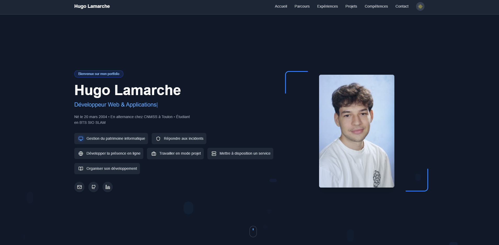

# Portfolio Hugo Lamarche 🌟

Bienvenue sur mon portfolio, un étudiant en BTS SIO SLAM. Ce projet présente mes réalisations et mes compétences en développement web.



## Table des matières 📚

- [Fonctionnalités](#fonctionnalités)
- [Technologies utilisées](#technologies-utilisées)
- [Projets](#projets)
- [Installation](#installation)
- [Déploiement](#déploiement)
- [Modifications récentes](#modifications-récentes)
- [Contact](#contact)

## Fonctionnalités ✨

- **Design Responsive** : S'adapte à tous les appareils (mobile, tablette, desktop)
- **Mode Sombre** : Activé par défaut, avec possibilité de basculer vers le mode clair
- **Animations** : Utilisation de Framer Motion pour des transitions fluides
- **Sections Complètes** : Présentation, compétences, expériences, projets et contact
- **Icônes Vectorielles** : Utilisation de react-icons pour des icônes de haute qualité

## Technologies utilisées 🛠️

- **React** : Bibliothèque JavaScript pour construire des interfaces utilisateur
- **TypeScript** : Superset de JavaScript qui ajoute des types statiques
- **Vite** : Outil de construction rapide pour les projets modernes
- **Tailwind CSS** : Framework CSS pour un design réactif et moderne
- **Framer Motion** : Bibliothèque d'animations pour React
- **React Icons** : Collection d'icônes populaires pour React
- **React Intersection Observer** : Pour déclencher des animations au défilement

## Projets 🚀

### 1. Codah
- **Description** : Application de gestion des dossiers administratifs pour les collectivités locales.
- **Technologies** : PHP, Symfony.
- **Fonctionnalités** :
  - Gestion centralisée des dossiers.
  - Suivi en temps réel des demandes.
  - Notifications automatisées.

### 2. FIB
- **Description** : Plateforme de gestion financière intégrée pour les entreprises.
- **Technologies** : PHP, Symfony.
- **Fonctionnalités** :
  - Suivi des transactions financières.
  - Génération de factures.
  - Rapports financiers détaillés.

### 3. SIJ
- **Description** : Système d'information jeunesse permettant aux jeunes d'accéder à des ressources et des événements.
- **Technologies** : PHP, Symfony.
- **Fonctionnalités** :
  - Annuaire des ressources locales.
  - Calendrier des événements.

### 4. GSB
- **Description** : Développement d'une application de gestion des frais pour le laboratoire pharmaceutique Galaxy Swiss Bourdin, permettant aux visiteurs médicaux de saisir et suivre leurs notes de frais.
- **Technologies** : PHP, HTML, CSS, JavaScript, SQL.
- **Fonctionnalités** :
  - Conception et développement d'une application web.
  - Mise en place d'une base de données MySQL pour la gestion des utilisateurs et des frais.
  - Implémentation d'un système d'authentification sécurisé.
  - Fonctionnalités de saisie, modification et consultation des fiches de frais.
  - Génération de rapports financiers pour le suivi des dépenses.
  - Tests unitaires et fonctionnels pour assurer la fiabilité de l'application.

## Installation ⚙️

Pour installer ce projet sur votre machine locale, suivez ces étapes :

1. Clonez le dépôt :
   ```bash
   git clone https://github.com/Hugolmh/portfolio-hugo.git
   ```

2. Accédez au répertoire du projet :
   ```bash
   cd portfolio-hugo
   ```

3. Installez les dépendances :
   ```bash
   npm install
   ```

4. Lancez le serveur de développement :
   ```bash
   npm run dev
   ```

## Déploiement 🌐

Pour déployer le projet sur GitHub Pages, exécutez les commandes suivantes :

1. Construisez le projet :
   ```bash
   npm run build
   ```

2. Déployez le contenu :
   ```bash
   npm run deploy
   ```

## Modifications récentes 🔄

- **Utilisation de react-icons** : Remplacement des images par des icônes vectorielles pour une meilleure performance et compatibilité
- **Mode sombre par défaut** : Le site s'affiche maintenant en mode sombre par défaut
- **Optimisation du code** : Suppression des fichiers et du code inutilisés
- **Documentation améliorée** : Ajout de commentaires dans le code pour faciliter la maintenance
- **Correction des problèmes d'affichage** : Amélioration de la visibilité des éléments en mode sombre

## Contact 📧

Pour toute question ou demande, vous pouvez me contacter à l'adresse suivante :
- **Email** : lamarche.hugo@orange.fr
- **GitHub** : [hugolmh](https://github.com/hugolmh)
- **LinkedIn** : [Hugo Lamarche](https://www.linkedin.com/in/hugo-lamarche-03a4342b7)

---

Merci de visiter mon portfolio ! 🎉
